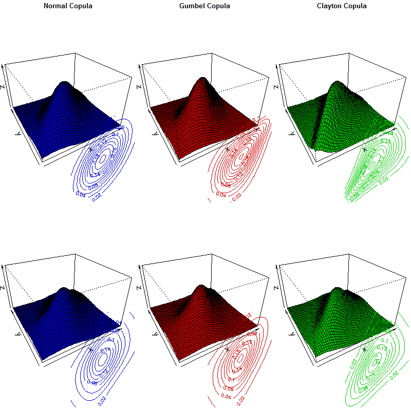

[](http://quantlet.de/index.php?p=info)

## [](http://quantlet.de/) **MVApcapfresults** [](http://quantlet.de/d3/ia)

```yaml

Name of Quantlet: COP3contourandcop
 
Published in: Copulae

Description: 'Six bivariate copula plots and their corresponding contour plots
are created including the Gaussian copula, the Gumbel copula and the Clayton 
copula. In the figure, the upper blue picture is a normal copula with 2 Gaussian
margins and an exchangeable parameter equal to 0.71. The lower blue plot is a 
normal copula with 2 Student-t margins with degree of freedom equal to 3. The
upper red plot is a Gumbel copula with 2 standard normal margins and an exchange-
able parameter is 2. The lower red plot is also a Gumbel copula with 2 t margins 
under degree of freedom of 3. The upper green plot is a Clayton copula with 2 
standard normal margins with an exchangeable parameter of 2. The lower green 
plot uses the same copula with the upper green but 2 t margins with degree of 
freedom equal to 3.' 
  
Keywords: clayton, contour, copula, gumbel, normal

Author: Ostap Okhrin, Yafei Xu

Submitted: Tue, October 28 2014 by Felix Jung
     
Output: 'This quantlet returns a plot of copula contour and its CDF in 3D.
Here copulas,normal copula, Gumbel copula and Clayton copula, are included.'


```



```r
rm(list = ls(all = TRUE))
dev.new(width = 13, height = 7)
# install.packages("copula")
# install.packages("mvtnorm")
library("copula")
library("mvtnorm")

# replace the path of the working directory if necessary
# setwd("C:/R") 

# set parameters
k.v         = seq(0, .90, length = 10)
i           = 6
kendall_tau = k.v[i]
clt         = (2 * kendall_tau) / (1 - kendall_tau)
gt          = 1 / (1 - kendall_tau)
garho       = sin(kendall_tau * pi / 2) # 0.71

split.screen(c(2, 3), erase = T) 
# do plot
# upper blue plot
screen(1, new = T)
par(mar = c(0, 0, 1, 0))
gmb   = normalCopula(garho, dim = 2, dispstr = "un")
myMvd = mvdc(gmb, c("norm", "norm"), list(list(mean = 0, sd = 1), 
             list(mean = 0, sd = 1)))
persp(myMvd, dMvdc, xlim = c(-2, 2), ylim = c(-2, 2), 
      col = "blue3", main = "Normal Copula", cex.main = 0.8, cex.axis = 0.8,
      lwd = 1.3, ylab = "y", xlab = "x", zlab = "z", zlim = c(0, 0.3), 
      axes = T, ticktype = "simple") 
screen(1, new = F)
split.screen(c(2, 2), screen = 1, erase = F) 
screen(10, new = F)
contour(myMvd, dMvdc, xlim = c(-2, 2), ylim = c(-2, 2), col = "blue3",
        main = "", cex.main = 0.8, lwd = 1.3, axes = F) 
# lower blue plot
screen(4, new = T)
par(mar = c(0, 0, 0, 0))
myMvd = mvdc(gmb, c("t", "t"), list(list(df = 3), list(df = 3)))
persp(myMvd, dMvdc, xlim = c(-2, 2), ylim = c(-2, 2),
      col = "blue3", cex.axis = 0.8, lwd = 1.3, ylab = "y", xlab = "x",
      zlab = "z", zlim = c(0, 0.3), ticktype = "simple")

screen(4, new = F)
split.screen(c(2, 2), screen = 4, erase = F) 
screen(14, new = F)
contour(myMvd, dMvdc, xlim = c(-2, 2), ylim = c(-2, 2), col = "blue3",
        cex.axis = 0.8, lwd = 1.3, axes = F)
# upper red plot
screen(2, new = T)
par(mar = c(0, 0, 1, 0))
gmb = gumbelCopula(gt, dim = 2)
myMvd = mvdc(gmb, c("norm", "norm"), list(list(mean = 0, sd = 1), 
             list(mean = 0, sd = 1)))
persp(myMvd, dMvdc, xlim = c(-2, 2), ylim = c(-2, 2), col = "red3",
      main = "Gumbel Copula", cex.main = 0.8, cex.axis = 0.8, lwd = 1.3,
      ylab = "y", xlab = "x", zlab = "z", zlim = c(0, 0.3),
      ticktype = "simple")

screen(2, new = F)
split.screen(c(2, 2), screen = 2, erase = F) 
screen(18, new = F)
contour(myMvd, dMvdc, xlim = c(-2, 2), ylim = c(-2, 2), col = "red3",
        cex.axis = 0.8, lwd = 1.3, axes = F)
# lower red plot
screen(5, new = T)
par(mar = c(0, 0, 0, 0))
myMvd = mvdc(gmb, c("t", "t"), list(list(df = 3), list(df = 3)))
persp(myMvd, dMvdc, xlim = c(-2, 2), ylim = c(-2, 2), col = "red3",
      cex.axis = 0.8, lwd = 1.3, ylab = "y", xlab = "x", zlab = "z",
      zlim = c(0, 0.3), ticktype = "simple")
screen(5, new = F)
split.screen(c(2, 2), screen = 5, erase = F) 
screen(22, new = F)
contour(myMvd, dMvdc, xlim = c(-2, 2), ylim = c(-2, 2), col = "red3",
        cex.axis = 0.8, lwd = 1.3, axes = F)
# upper green plot
screen(3, new = T)
par(mar = c(0, 0, 1, 0))
gmb = claytonCopula(clt, dim = 2)
myMvd = mvdc(gmb, c("norm", "norm"), list(list(mean = 0, sd = 1),
             list(mean = 0, sd = 1)))
persp(myMvd, dMvdc, xlim = c(-2, 2), ylim = c(-2, 2), col = "green3",
      main = "Clayton Copula", cex.main = 0.8, cex.axis = 0.8, lwd = 1.3,
      ylab = "y", xlab = "x", zlab = "z", zlim = c(0, 0.3),
      ticktype = "simple")
screen(3, new = F)
split.screen(c(2, 2), screen = 3, erase = F) 
screen(26, new = F)
contour(myMvd, dMvdc, xlim = c(-2, 2), ylim = c(-2, 2), col = "green3",
        cex.axis = 0.8, lwd = 1.3, axes = F)
# lower green plot
screen(6, new = T)
par(mar = c(0, 0, 0, 0))
myMvd = mvdc(gmb, c("t", "t"), list(list(df = 3),list(df = 3)))
persp(myMvd, dMvdc, xlim = c(-2, 2), ylim = c(-2, 2), col = "green3",
      cex.axis = 0.8, lwd = 1.3, ylab = "y", xlab = "x", zlab = "z",
      zlim = c(0, 0.3), ticktype = "simple")
screen(6, new = F)
split.screen(c(2, 2), screen = 6, erase = F) 
screen(30, new = F)
contour(myMvd, dMvdc, xlim = c(-2, 2), ylim = c(-2, 2), col = "green3",
        cex.axis = 0.8, lwd = 1.3, axes = F)
```
