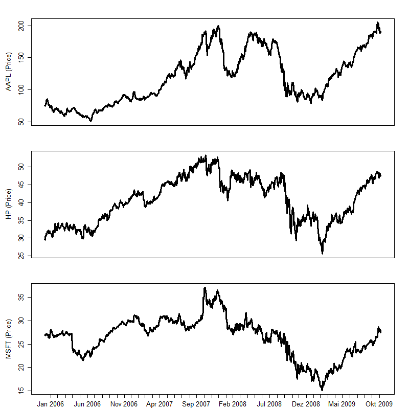

[](http://quantlet.de/index.php?p=info)

## [](http://quantlet.de/) **MVApcapfresults** [](http://quantlet.de/d3/ia)

```yaml

Name of Quantlet: COPapp1prices
 
Published in:     Copulae

Description:		 'COPapp1prices plots time series of daily stock prices from three different companies,
                  including Apple (AAPL), the Hewlett Packard (HP), and Microsoft (MSFT), from 
                  04.01.2006 to 04.11.2009.' 
  
Keywords:         plot, stock-price, time-series, Apple, Hewlett Packard, Microsoft, daily
     
See also:         COPapp1residual, COPapp1return, MMSTATtime_series_1

Author:           Ostap Okhrin, Yafei Xu

Datafile:		      COPapp1data.csv

Submitted:        Tue, October 28 2014 by Felix Jung
     
Output:          'The Quantlet returns time series plots of 3 companies' prices, APL, HP and MSFT, with
                  window 04.01.2006 - 04.11.2009.'

```




```r
rm(list = ls(all = TRUE))
# replace the path of the working directory if necessary
# setwd("C:/R") 
file.name   = "COPapp1prices.csv" # read data
X           = read.csv(file.name, header = FALSE) # read data set
rownames(X) = X[, 1]
X           = X[, -1]
where.put   = which(diff(as.numeric(format(as.Date(rownames(X), "%d.%m.%Y"),
                                           "%Y%m"))) != 0)
labels      = format(as.Date(rownames(X), "%d.%m.%Y"), "%b %Y")
# do plot
dev.new(width = 8, height = 8) 
layout(matrix(1:3, nrow = 3, byrow = T))

# plot 1
par(mai = (c(0.0, 0.55, 0.2, 0.1) + 0.3))
plot(as.numeric(X[, 1]), type = "l", lwd = 3, 
     ylab = paste("AAPL ", "(Price)", sep = ""), 
     axes = F, frame = T, cex.lab = 1.2)
axis(2, cex.axis = 1.2)
# plot 2
par(mai = (c(0.1, 0.55, 0.1, 0.1) + 0.3))
plot(as.numeric(X[, 2]), type = "l", lwd = 3, 
     ylab = paste("HP ", "(Price)", sep = ""), axes = F,
     frame = T, cex.lab = 1.2)
axis(2, cex.axis = 1.2)
# plot 3
par(mai = (c(0.3, 0.55, 0.0, 0.1) + c(0.1, 0.3, 0.3, 0.3)))
plot(as.numeric(X[, 3]), type = "l", lwd = 3, 
     ylab = paste("MSFT ", "(Price)", sep = ""),
     cex.axis = 1.2, cex.lab = 1.2, frame = T, axes = F)
axis(2, cex.axis = 1.2)
axis(1, at = where.put, labels = labels[where.put], cex.axis = 1.2)
```
