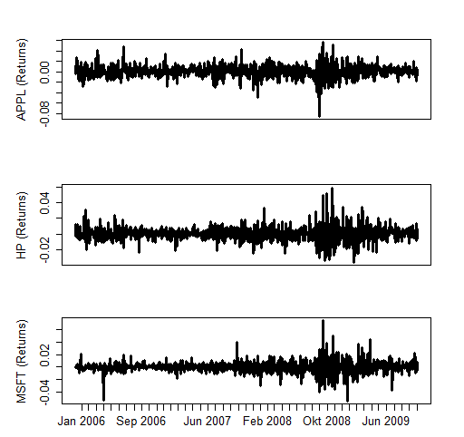

[](http://quantlet.de/index.php?p=info)

## [](http://quantlet.de/) **COPapp1return** [](http://quantlet.de/d3/ia)

```yaml

Name of Quantlet : COPapp1return

Published in : Copulae

Description : 'COPapp1return gives time series plots of 3 companies'' daily returns. The three
companies Apple (APL), the Hewlett Packard (HP) and Microsoft (MSFT) are contained. In the figures
the window from 04.01.2006 to 04.11.2009 is considered.'

Keywords : plot, returns, time-series, Hewlett Packard, Microsoft, daily

See also : COPapp1prices, COPapp1residual

Author : Ostap Okhrin, Yafei Xu

Datafile : COPapp1return.csv

Submitted : Mon, Nov 10 2014 by Felix Jung

Output : 'The quantlet returns time series plots of 3 companies'' returns, APL, HP and MSFT, with
window 04.01.2006 - 04.11.2009.'

```




### R Code:
```r
rm(list = ls(all = TRUE))
#setwd("C:/...") # please change your working directory
file.name   = "COPapp1return.csv" # read data
X           = read.csv(file.name, header=F) # read data set
rownames(X) = X[, 1]
X           = X[, -1]
where.put   = which(diff(as.numeric(format(as.Date(rownames(X), "%d.%m.%Y"),
                                           "%Y%m"))) != 0)
labels      = format(as.Date(rownames(X), "%d.%m.%Y"), "%b %Y")
# do plot

layout(matrix(1:3, nrow = 3, byrow = T))
par(mai = (c(0.0, 0.55, 0.2, 0.1) + 0.4))
plot(as.numeric(X[, 3]), type = "l", lwd = 3, 
     ylab = paste("APPL ", "(Returns)", sep = ""),xlab="",
 	 axes = F, frame = T, cex.lab = 1.2)
axis(2, cex.axis = 1.2)

par(mai = (c(0.0, 0.55, 0.2, 0.1) + 0.4))
plot(as.numeric(X[, 6]), type = "l", lwd = 3, 
     ylab = paste("HP ", "(Returns)", sep = ""), xlab="",
	 axes = F, frame = T, cex.lab = 1.2)
axis(2, cex.axis = 1.2)

par(mai = (c(0.3, 0.55, 0.0, 0.1) + c(0.2, 0.4, 0.4, 0.4)))
plot(as.numeric(X[, 9]), type = "l", lwd = 3, 
     ylab = paste("MSFT ", "(Returns)", sep = ""), xlab="",
	 cex.axis = 1.2, cex.lab = 1.2, frame = T, axes = F)
axis(2, cex.axis = 1.2)
axis(1, at = where.put, labels = labels[where.put], cex.axis = 1.2)


```
