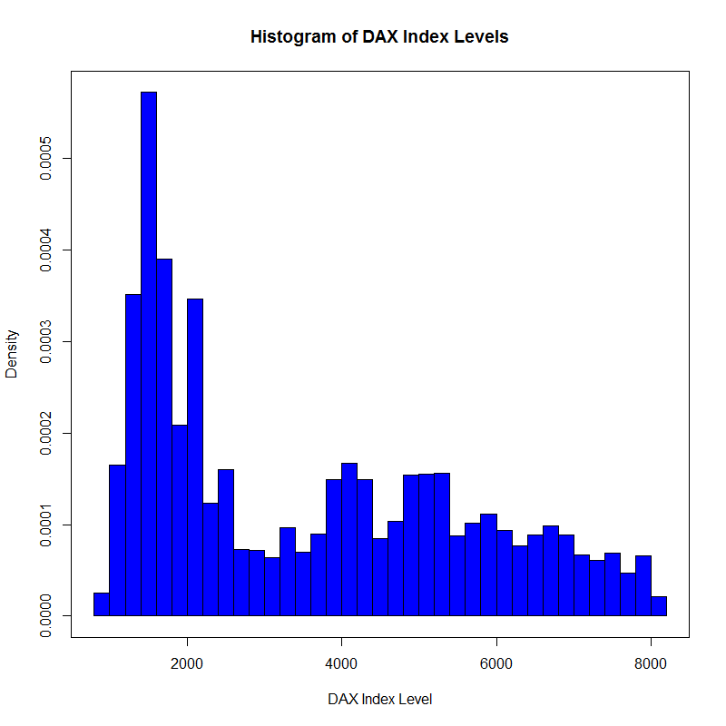

[](http://quantlet.de/index.php?p=info)

## [](http://quantlet.de/) **COPdaxhistogram**[](http://quantlet.de/d3/ia)

```yaml
Name of Quantlet: COPdaxhistogram
 
Published in: Copulae

Description: 'This quantlet plots a histogram of daily
DAX 30 index levels from 1986-01-02 until 2012-12-30.'
  
Keywords: histogram, plot, distribution, DAX index, daily, density
     
See also: COPdaxtimeseries, COPdensitydaxreturn

Author: Ostap Okhrin, Yafei Xu

Datafile: COPdax140624.csv

Submitted: Mon, October 28 2014 by Felix Jung

```



```r
# replace the path of the working directory if necessary
# setwd("C:/R") 
d         = read.csv("COPdax140624.csv")
DateInput = as.Date(d[, 1])
numOfDate = as.numeric(as.Date(c(DateInput)))
newDF     = data.frame(d,numOfDate)
sortNewDF = newDF[order(newDF[, 3]), ]
newDF2    = data.frame(sortNewDF, seq(1,length(newDF[, 3]),
                       length.out = length(newDF[, 3]))) 
P         = newDF2[, 2]

# plot histogram
hist(P, prob=TRUE, 12, main = "Histogram of DAX Index Levels", xlab = "DAX Index Level", col = "Blue", 
     freq = F, breaks = 37)
options(scipen = 8)
box()
```
