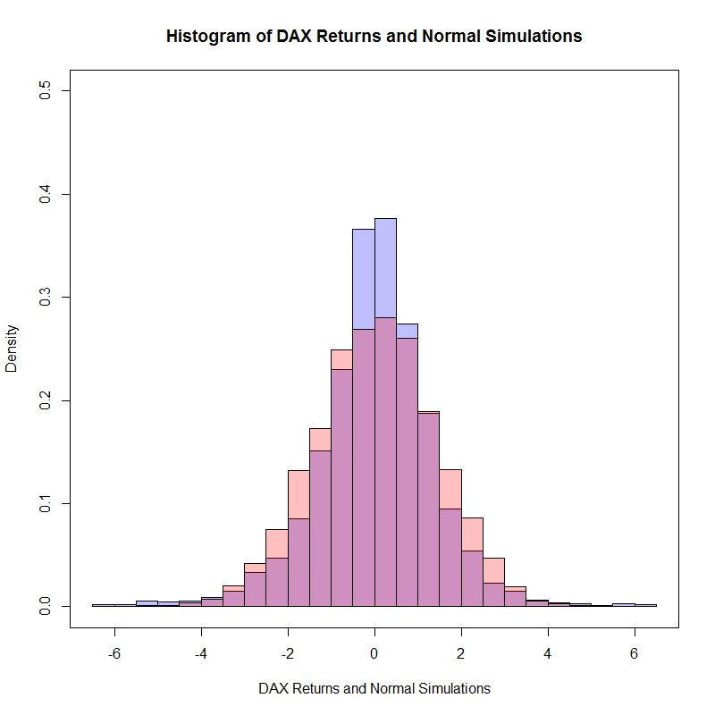

[](http://quantlet.de/)

## [](http://quantlet.de/) **COPdaxnormhist** [](http://quantlet.de/)

```yaml

Name of Quantlet : COPdaxnormhist

Published in : Copulae

Description : 'COPdaxnormhist gives histogram of DAX returns compared to the normal CDF. Here the
normal simulations are based on the parameters that mean = 0.0002 and standard deviation = 0.0141.
In the plot, the blue straps plus the purple straps stand for the DAX returns' histogram, and the
pink straps plus the purple straps stand for the histogram of the normal simulations with the
aforementioned parameters. And the purple straps stand for the over- lapped parts of the both
histograms. Here the number of the points of the time series used in the computation is 5771, which
is the same number as the number of the normal simulations'

Keywords : density, histogram, plot, distribution, DAX index, daily, normal, CDF

Author : Ostap Okhrin, Yafei Xu

Datafile : COPdax140624.csv

Submitted : Tue, November 18 2014 by Philipp Gschoepf

Example : Histogram of the DAX returns compared to a simulated normal sample.

```




### R Code:
```r
# replace the path of the working directory if necessary
# setwd("C:/R") 
d         = read.csv("COPdax140624.csv") # pls download the pertinent data set.
DateInput = as.Date(d[, 1])
numOfDate = as.numeric(as.Date(c(DateInput)))
newDF     = data.frame(d, numOfDate)
sortNewDF = newDF[order(newDF[, 3]),]
newDF2    = data.frame(sortNewDF, seq(1, length(newDF[, 3]),
                       length.out = length(newDF[, 3])))
Pt        = newDF[, 2]
P1        = Pt[ - length(Pt)]
P2        = Pt[ - 1]
DAXreturn = log(P1/P2)
DAXreturn = data.frame(DAXreturn,length(DAXreturn):1)
DAXreturn = DAXreturn[order(DAXreturn[, 2]),]
DAXreturn = DAXreturn[, 1] * 100
r         = DAXreturn[ - which(DAXreturn >= 6.5 | DAXreturn <= - 6.5)]

# sample of Gaussian mu = 0.0002113130, sigmaSquare = 0.0002001865
rNorm     = 100 * rnorm(length(r), mean = 0.0002113130, sd = sqrt(0.0002001865))

# do plot
hist1 = hist(r, prob = TRUE, 12, freq = F, breaks = 24) 
hist2 = hist(rNorm, prob = TRUE, 12, freq = F, breaks = 24) 
plot(seq(-6.5, 6.5, length.out = 10), seq(0, .5, length.out = 10),
     ylab = "Density", xlab = "DAX Returns and Normal Simulations", col = "White", 
	 main = "Histogram of DAX Returns and Normal Simulations")
plot(hist1, col = rgb(0, 0, 1, 1 / 4), xlim = c(-6, 6), freq = F, add = T)  
plot(hist2, col = rgb(1, 0, 0, 1 / 4), xlim = c(-6, 6), add = T, freq = F)  
box()


```
