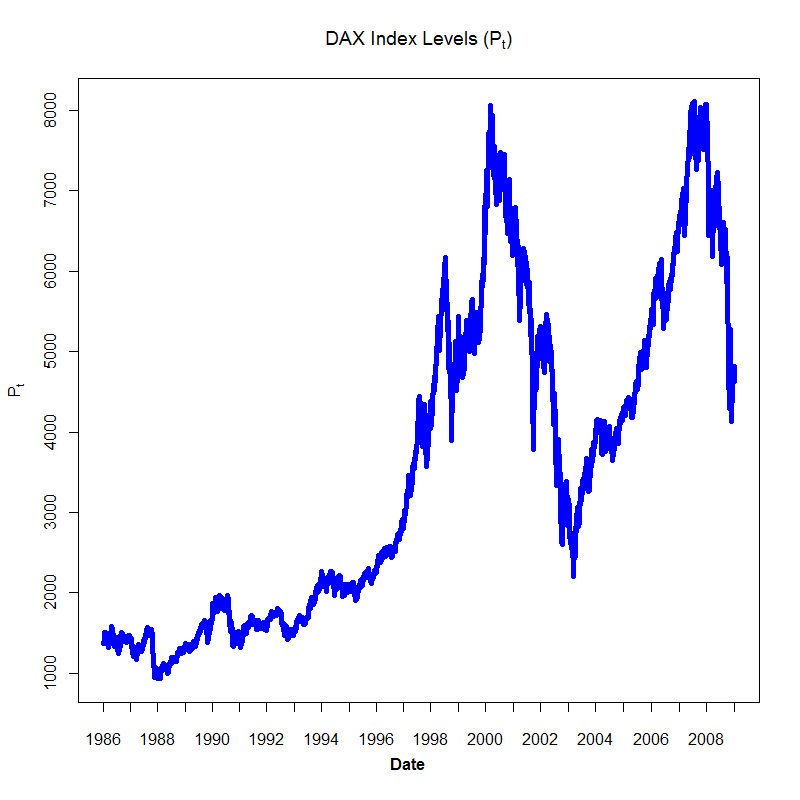

[](http://quantlet.de/index.php?p=info)

## [](http://quantlet.de/) **COPdaxtimeseries**[](http://quantlet.de/d3/ia)

```yaml
Name of Quantlet: COPdaxtimeseries
 
Published in: Copulae

Description: 'COPdaxtimeseries gives a time series plot of the DAX index
levels with the window from 1986-01-02 to 2008-12-30.'

Keywords: plot, time-series, DAX, DAX index, time-series plot
     
See also: 'COPdaxhistogram, COPdaxreturnhist, COPdensitydaxreturn, MMSTATtime_series_1'

Author: Ostap Okhrin, Yafei Xu

Datafile: COPdax140624.csv

Submitted: Tue, October 28 2014 by Sergey Nasekin
     
Output: COPdaxtimeseries gives a time series plot of DAX index

Example: a time series plot of DAX index


```



### R Code:
```r
#setwd("C:/...") # please change your working directory
d         = read.csv("COPdax140624.csv")
DateInput = as.Date(d[, 1])
numOfDate = as.numeric(as.Date(c(DateInput)))
newDF     = data.frame(d,numOfDate)
sortNewDF = newDF[order(newDF[, 3]),]
newDF2    = data.frame(sortNewDF,seq(1,length(newDF[, 3]),
                    length.out=length(newDF[, 3])))
dateNum1  = as.numeric(as.Date(c("1986-01-02", "1987-01-02", "1988-01-04",
                                "1989-01-02", "1990-01-02", "1991-01-02",
								"1992-01-02", "1993-01-04",
                                "1994-01-03", "1995-01-02", "1996-01-02",
								"1997-01-02", "1998-01-02", "1999-01-04", 
								"2000-01-03", "2001-01-02",
								"2002-01-02", "2003-01-02", "2004-01-02", 
								"2005-01-03", "2006-01-02", "2007-01-02",
								"2008-01-02", "2008-12-30")))
At = c(newDF2[which(newDF2[, 3] == as.numeric(as.Date(c("1986-01-02")))), 4],
newDF2[which(newDF2[, 3] == as.numeric(as.Date(c("1987-01-02")))), 4],
newDF2[which(newDF2[, 3] == as.numeric(as.Date(c("1988-01-04")))), 4],
newDF2[which(newDF2[, 3] == as.numeric(as.Date(c("1989-01-02")))), 4],
newDF2[which(newDF2[, 3] == as.numeric(as.Date(c("1990-01-02")))), 4],
newDF2[which(newDF2[, 3] == as.numeric(as.Date(c("1991-01-02")))), 4],
newDF2[which(newDF2[, 3] == as.numeric(as.Date(c("1992-01-02")))), 4],
newDF2[which(newDF2[, 3] == as.numeric(as.Date(c("1993-01-04")))), 4],
newDF2[which(newDF2[, 3] == as.numeric(as.Date(c("1994-01-03")))), 4],
newDF2[which(newDF2[, 3] == as.numeric(as.Date(c("1995-01-02")))), 4],
newDF2[which(newDF2[, 3] == as.numeric(as.Date(c("1996-01-02")))), 4],
newDF2[which(newDF2[, 3] == as.numeric(as.Date(c("1997-01-02")))), 4],
newDF2[which(newDF2[, 3] == as.numeric(as.Date(c("1998-01-02")))), 4],
newDF2[which(newDF2[, 3] == as.numeric(as.Date(c("1999-01-04")))), 4],
newDF2[which(newDF2[, 3] == as.numeric(as.Date(c("2000-01-03")))), 4],
newDF2[which(newDF2[, 3] == as.numeric(as.Date(c("2001-01-02")))), 4],
newDF2[which(newDF2[, 3] == as.numeric(as.Date(c("2002-01-02")))), 4],
newDF2[which(newDF2[, 3] == as.numeric(as.Date(c("2003-01-02")))), 4],
newDF2[which(newDF2[, 3] == as.numeric(as.Date(c("2004-01-02")))), 4],
newDF2[which(newDF2[, 3] == as.numeric(as.Date(c("2005-01-03")))), 4],
newDF2[which(newDF2[, 3] == as.numeric(as.Date(c("2006-01-02")))), 4],
newDF2[which(newDF2[, 3] == as.numeric(as.Date(c("2007-01-02")))), 4],
newDF2[which(newDF2[, 3] == as.numeric(as.Date(c("2008-01-02")))), 4],
newDF2[which(newDF2[, 3] == as.numeric(as.Date(c("2008-12-30")))), 4])
dateC=c("1986", "", "1988", "", "1990", "", "1992", "", 
        "1994", "", "1996",
        "", "1998", "", "2000", "", "2002", "", "2004", "",
		"2006", "", "2008", "")
# do plot
dev.new(width = 13, height = 7) 
plot(1:length(newDF[, 2]), seq(min(newDF[, 2]), max(newDF[, 2]),
     length.out=length(newDF[, 2])), xlab = "", ylab = "", 
	 main = expression("DAX Index Levels ("*P[t]*")"), col = "White", 
	 axes = FALSE, xaxt = "n", yaxt = "n")
box() 
axis(1, at = At, labels = F)
axis(2, at = c(1000, 2000, 3000, 4000, 5000, 6000, 7000, 8000)) 
mtext(expression(P[t]), side = 2, line = 2.7, 
      at = seq(min(newDF[, 2]), max(newDF[, 2]), 
	  length.out = 13)[7], font = 2, cex = 1)  
mtext("Date", side = 1, line = 2.7, at = 2800, font = 2, cex = 1) 
text(cex = 1, x = At, y = 200, dateC, xpd = TRUE) 

# time series plot
lines(1:length(newDF[, 2]), sortNewDF[, 2], pch = 1, lty = 1,
      col = "blue", lwd = 5)
```
