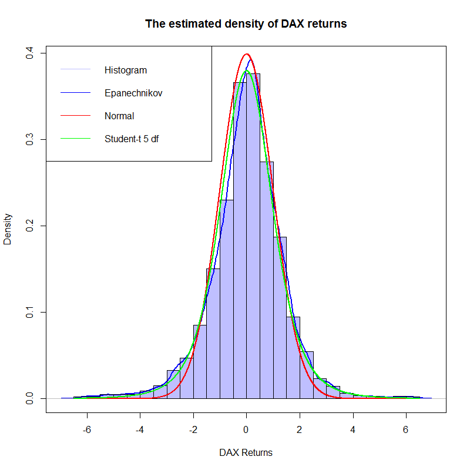

[](http://quantlet.de/)

## [](http://quantlet.de/) **COPdensitydaxreturn** [](http://quantlet.de/)

```yaml

Name of Quantlet : COPdensitydaxreturn

Published in : Copulae

Description : 'COPdensitydaxreturn gives the DAX histogram compared to the 3 densities including
the standard normal density in red, the Student-t density in green with degrees of freedom equal to
5 and the estimated Epanechnikov kernel density in blue with the bandwidth computed following that
0.9 times the minimum of the standard deviation and the interquartile range divided by 1.34 times
the sample size to the negative one-fifth power, i.e. Silverman's rule-of-thumb.'

Keywords : Epanechnikov, density, histogram, normal, student, kernel

See also : COPdaxhistogram, COPdaxreturnhist, COPdaxtimeseries

Author : Ostap Okhrin, Yafei Xu

Datafile : COPdax140624.csv

Submitted : Mon, November 03 2014 by Felix Jung

Output : 'COPdensitydaxreturn gives the DAX histogram compared to the 3 theoretical densities
including normal, Student-t and Epanechnikov.'

```




### R Code:
```r
rm(list = ls(all = TRUE))
#setwd("C:/...") # please change your working directory
d         = read.csv("COPdax140624.csv") # pls download the pertinent data set.
DateInput = as.Date(d[, 1])
numOfDate = as.numeric(as.Date(c(DateInput)))
newDF     = data.frame(d, numOfDate)
sortNewDF = newDF[order(newDF[, 3]), ]
newDF2    = data.frame(sortNewDF, seq(1, length(newDF[, 3]),
                       length.out = length(newDF[, 3])))
Pt        = newDF[, 2]
P1        = Pt[ - length(Pt)]
P2        = Pt[ - 1]
DAXreturn = log(P1/P2)
DAXreturn = data.frame(DAXreturn, length(DAXreturn) : 1)
DAXreturn = DAXreturn[order(DAXreturn[, 2]), ]
DAXreturn = DAXreturn[, 1] * 100
r         = DAXreturn[ - which(DAXreturn >= 6.5 | DAXreturn <= - 6.5)]

# kernel density,  normal samples and t samples
epaDensity = density(r, bw = "nrd0", kernel = c("epanechnikov"))
dNorm = dnorm(seq(-6.5, 6.5, length.out = length(r)), mean = 0, sd = 1)
dT = dt(seq(-6.5, 6.5, length.out = length(r)), df = 5)		

# do plot
hist1 = hist(r, prob = TRUE, 12, main = "Histogram of DAX Return", 
             col = "lightblue", freq = F, breaks = 24) 

# kernel density estimation
plot(epaDensity, col = "Blue", lwd = 2, xlab = "DAX Returns", ylab = "Density", 
     main = "The estimated density of DAX returns")
plot(hist1, col = rgb(0, 0, 1, 1/4), xlim = c(-6, 6), 
     freq = F, add = T) 
lines(seq(-6.5, 6.5, length.out = length(r)), dNorm, 
      col = "Red", lwd = 2)
lines(seq(-6.5, 6.5, length.out = length(r)), dT,  
      col = "Green", lwd = 2)
legend("topleft", c("Histogram", "Epanechnikov", "Normal", "Student-t 5 df"),
       lty = 1, col = c(rgb(0, 0, 1, 1/4), "Blue", "Red", "Green"))
box()
```
