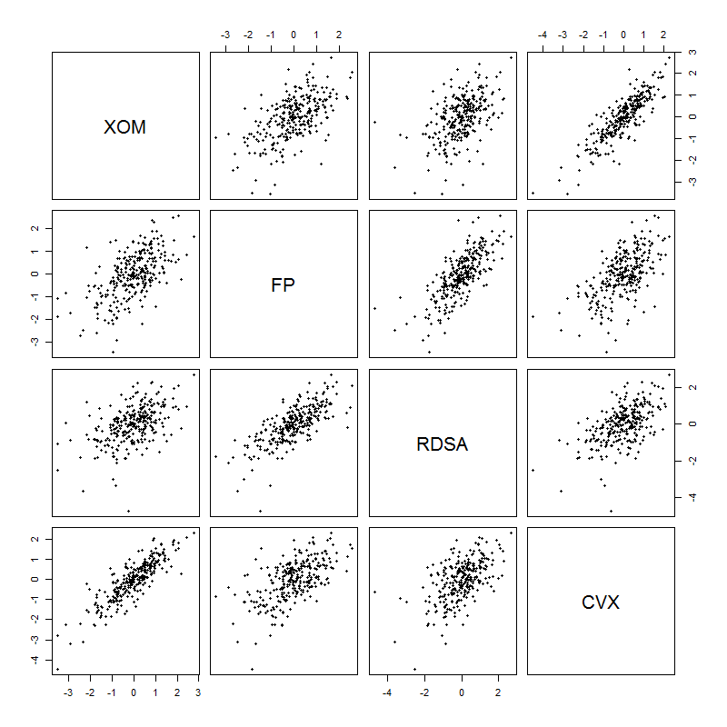

[](http://quantlet.de/)

## [](http://quantlet.de/) **COPhac4firmsscatter** [](http://quantlet.de/)

```yaml

Name of Quantlet : COPhac4firmsscatter

Published in : Copulae

Description : 'COPhac4firmsscatter gives pairwise scatterplots from ARMA-GARCH residuals provided
from the HAC package, including Chevron Corporation (CVX), Exxon Mobil Corporation (XOM), Royal
Dutch Shell (RDSA) and Total (FP) covering n = 283 observations from 2011-02-02 to 2012-03-19.'

Keywords : correlation, scatterplot, firms, Chevron, Exxon Mobil, Royal Dutch, energy, oil

See also : MMSTATlinreg, MMSTATscatterplot

Author : Ostap Okhrin, Yafei Xu

Submitted : Tue, November 18 2014 by Franziska Schulz

Output : 'The Quantlet returns pairwise scatter plots from ARMA-GARCH residuals, including CVX, FP,
RDSA, XOM.'

```




### R Code:
```r
rm(list = ls(all = TRUE))
#install.packages("HAC")
library(HAC)
data(finData)
X         = finData # read data set
eps       = X
# do plot
pairs(eps, pch = 20)


```
