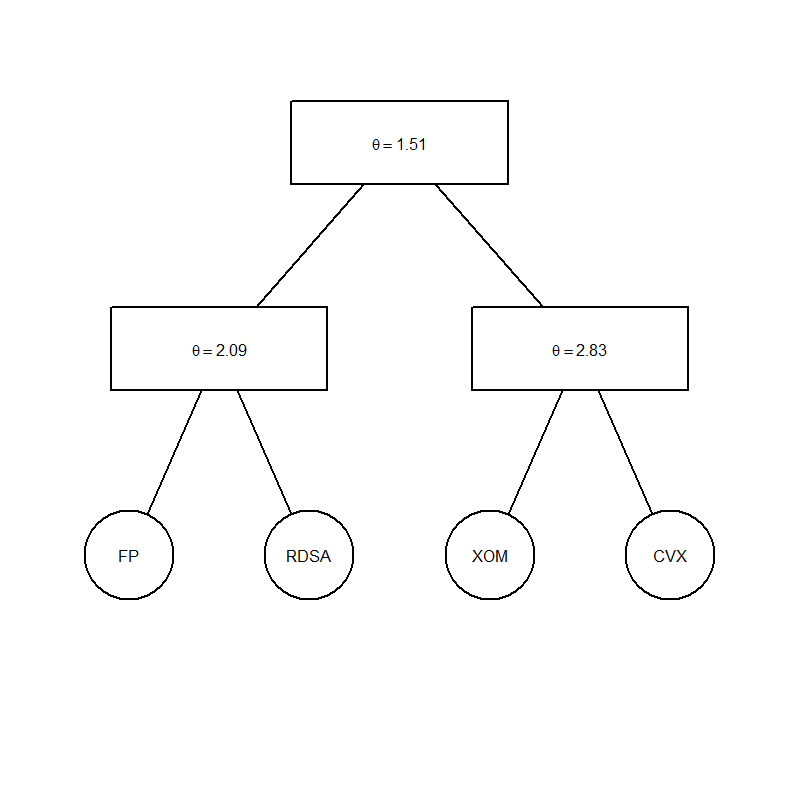

[](http://quantlet.de/index.php?p=info)

## [](http://quantlet.de/) **COPhac4firmstree3**[](http://quantlet.de/d3/ia)

```yaml
Name of Quantlet: COPhac4firmstree3
 
Published in: Copulae

Description: 'COPhac4firmstree3 is used to give a tree plot of a 4-dim HAC.
And after the fitting the 4 firms data to the HAC the parameters are also 
estimated. Here the HAC is employed under the Gumbel generator and margins
is given by the empirical CDF. The data is from ARMA-GARCH residuals from 
HAC package, including Chevron Corporation (CVX), Exxon Mobil Corporation 
(XOM), Royal Dutch Shell (RDSA) and Total (FP) covering n = 283 observations
from 20110202 to 20120319.'
  
Keywords: HAC, copula, gumbel, firms, tree, residuals

Author: Ostap Okhrin, Yafei Xu

Datafile: CopTreeFile

Submitted: Tue, November 18 2014 by Philipp Gschoepf

Example: Example of a tree


```



### R Code:
```r

rm(list = ls(all = TRUE))
#install.packages("HAC")
library(HAC)
data(finData)
X         = finData # read data set
eps       = X
result2   = estimate.copula (X = eps , type = 1, method = 1 , epsilon = 0.3,
                             agg.method = "mean", margins = "edf")
plot(result2)

```
