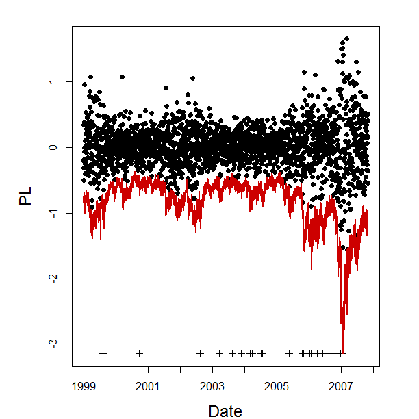
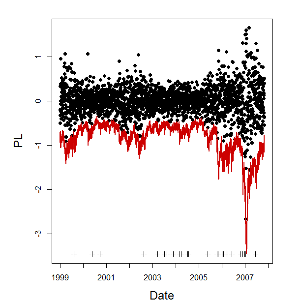

[](http://quantlet.de/index.php?p=info)

## [](http://quantlet.de/) **COPlcpexVaR**[](http://quantlet.de/d3/ia)

```yaml
Name of Quantlet: COPlcpexVaR
 
Published in: Copulae

Description: 'COPlcpexVaR computes from the results of fitting a Garch(1, 1) model to
daily returns, see COPlcpexgarch, and choosing the HAC model, see COPlcpexres, the profit
and loss function (dots) with the 99%-VaR bound (solid line) and the time points of the 
exceedances (pluses).'
  
Keywords: HAC, clayton, gumbel, kendall, multivariate, gaussian, gauss

See also: COPlcpeinaparch, COPlcpexgarch, COPlcpexres, COPlcpinVaR, COPlcpinres

Author: Ostap Okhrin

Datafile: 'COPts2AClayton.dat, COPts2AGumbel.dat, COPts2dates.dat, COPts2eps.dat, COPts2parameters.dat,
COPts2sigmat.dat, cop_timeseries_2'

Submitted: Tue, October 07 2014 by Felix Jung

Input: COPhelperfunctions
     
Output: 'The Quantlet returns plots which show the profit and loss function (dots) for exchange rates with the 
99%-VaR bound (solid line) and the time points of the exceedances (pluses) for the HAC model with Gumbel and 
Clayton generators'


Example: see COPlcpexres


```




```r
rm(list=ls(all=TRUE))

# install.packages("copula")
library(copula)

#setwd("C:/...")        # please change your working directory

source("COPhelperfunctions.R")

X = read.table("cop_timeseries_2", header = T, sep = "", dec=",")
X = X[, -1]
R = apply(log(X), 2, diff)

dates = read.table("COPts2dates")
dates = as.matrix(dates)

# results from the Quantlets COPlcpexgarch and COPlcpexres
COPAGumbel  = read.table("COPts2AGumbel", header = T, sep = " ", dec = ".", 
  row.names = NULL)
COPAGumbel  = COPAGumbel[, -1]
COPAClayton = read.table("COPts2AClayton", header = T, sep = " ", dec = ".", 
  row.names = NULL)
COPAClayton = COPAClayton[, -1]
eps         = read.table("COPts2eps", header = T, sep = ",", dec = ".", 
  row.names = NULL)
COPsigma.t  = read.table("COPts2sigmat")
COPparams   = read.table("COPts2parameters", header = T, 
  row.names = c("JPY", "JPYsigma", "GBP", "GBPsigma", "USD", "USDsigma"))
COPparams   = COPparams[-1]


skip        = 467 # value results from the quantlet COPlcpexres

sim         = 1000
portfolios  = 100
w           = rbind(c(1, 1, 1),matrix(runif((portfolios - 1) * 3), ncol = 3))
w           = w / matrix(rep(rowSums(w), 3), ncol = 3)
portfolios  = dim(w)[1]
l.quantiles = c(0.01, 0.05, 0.1)


doVaR = function(){
  s.eps = 0
  length.data = dim(COPAClayton)[1]
  ## simulation of residuals (eps)
  for(l in 1:length.data){
    l <<- l
    if(copula.in.use == "clayton"){
      u = rnacopula(sim, onacopula("C", C(copClayton@iTau(theta2tau(COPAClayton[l, "theta1"], 
        copula.in.use)), 3, C(copClayton@iTau(theta2tau(COPAClayton[l, "theta2"], 
        copula.in.use)), c(1, 2)))))
      if(COPAClayton[l, "structure"] == 2){
        u = u[, c(1, 3, 2)]
      } else if(COPAClayton[l,"structure"] == 3){
        u = u[, c(3, 2, 1)]
      }
    } else if(copula.in.use == "gumbel"){
      u = rnacopula(sim, onacopula("G", C(copGumbel@iTau(theta2tau(COPAGumbel[l, "theta1"], 
        copula.in.use)), 3, C(copGumbel@iTau(theta2tau(COPAGumbel[l, "theta2"], 
        copula.in.use)), c(1, 2)))))
      if(COPAGumbel[l, "structure"] == 2){
        u = u[, c(1, 3, 2)]
      } else if(COPAGumbel[l, "structure"] == 3){
        u = u[, c(3, 2, 1)]
      }
    }
    s.eps = rbind(s.eps, rbind(quantile(eps[, 1], probs = u[, 1]), 
                               quantile(eps[, 2], probs = u[, 2]), 
                               quantile(eps[, 3], probs = u[, 3])))
    if(copula.in.use == "clayton"){
      print(paste(l, "/", dim(COPAClayton)[1]))
    } else if(copula.in.use == "gumbel"){
      print(paste(l, "/", dim(COPAGumbel)[1]))
    }
  }
  s.eps = s.eps[-1,]
  
  ## calculation of simulated returns (eps + GARCH(1,1))
  res = list()
  for(i in 1:sim){
    R.new = X[skip:(dim(COPsigma.t)[1] - 1),] * (exp(matrix(rep(COPparams[c(1, 3, 5), "mu"], 
      each = length.data), ncol = 3) + COPsigma.t[(skip + 1):dim(COPsigma.t)[1],] * 
      matrix(s.eps[, i], ncol = 3, byrow = TRUE)) - 1)
    for(j in 1:portfolios){
      if(i == 1){
        res[[j]] = rowSums(R.new * matrix(rep(w[j,], each = dim(R.new)[1]), ncol = 3))
      } else{res[[j]] = cbind(res[[j]], rowSums(R.new * matrix(rep(w[j,], each = dim(R.new)[1]), 
          ncol = 3)))
      }
    }
    print(paste(i, "/", sim))
  }
  
  ## calculation of losses (eps + GARCH(1,1) + F^{-1})
  VaRs = list()
  for(j in 1:portfolios){
    VaRs[[j]] = t(apply(res[[j]], 1, quantile, prob = l.quantiles))
    print(paste(j, "/", portfolios))
  }
  
  ## true Profit Loss function
  L = matrix(0, dim(R)[1], portfolios)
  for(j in 1:portfolios)
    L[, j] = as.vector(rowSums(matrix(rep(w[j,], each = (dim(R)[1])), ncol = 3) * 
      X[-1,] * (exp(R) - 1)))
  
  L = tail(L, length.data)
  
  ## actually VaRs
  res.VaRs = 0
  for(j in 1:portfolios){
    res.VaRs = rbind(res.VaRs, colSums(VaRs[[j]] > matrix(rep(L[, j], 
      length(l.quantiles)), ncol = 3)))
  }
  res.VaRs = res.VaRs[-1,]
  res.VaRs = res.VaRs / length.data
  
  dev.new()
  labels    = as.numeric(format(as.Date(dates, "%d.%m.%Y"), "%Y"))
  where.put = c(1, which(diff(labels) == 1) + 1)

  par(mai = c(0.5, 0.8, 0.1, 0.3) + 0.3)
  ylimL = range(rbind(L[, 1], VaRs[[1]][, 1]))
  Lmod  = L[, 1]
  Lmod[Lmod < VaRs[[1]][, 1]] = min(ylimL)
  pchL  = rep(19, length(Lmod))
  pchL[which(L[, 1] < VaRs[[1]][, 1])] = 3
  plot(Lmod, pch = pchL, col = "black", lty = "solid", axes = F, frame = T, 
    xlab = "Date", ylab = "PL", cex.lab = 1.5, cex.axis = 1.2, ylim = ylimL) 
  lines(VaRs[[1]][, 1], col = "red3", lwd = 2)
  axis(2)         
  axis(1, at = where.put, labels = labels[where.put])   
}

copula.in.use = "gumbel"
doVaR()
copula.in.use = "clayton"
doVaR()
```
